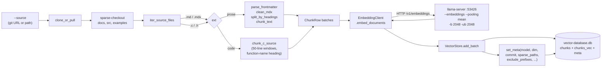
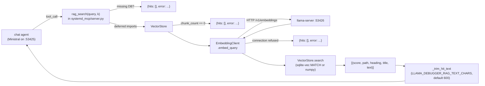

# systemd_mcp.vectordb

Self-contained RAG subsystem for `llama.cpp.debugger`. A thin wrapper
around [`sqlite-vec`](https://github.com/asg017/sqlite-vec) plus an
embedding client that talks to a second `llama-server --embeddings`
instance, plus an LVGL-aware ingester. No daemon, no ANN approximation,
no external scheduler — one `.db` file on disk and one HTTP endpoint for
embeddings.

This README is a contributor map. For end-user demo flow see the
[top-level README](../../README.md#vector-db-demo-lvgl-docs--source).

## GUI front-end

There is a native desktop control panel for this store in the sibling
[`systemd_mcp.vectordb_ui`](../vectordb_ui/README.md) package (Toga /
GTK). It streams `journalctl` over SSH and ingests it into the store,
runs `rag_search`-style queries, and manages the `.db` file (switch /
rename / delete / clear / rebuild). It is an optional consumer: it
imports `EmbeddingClient` and `VectorStore` from here, but nothing in
this package depends on it, so headless installs can skip the
`toga` / `toga-gtk` extras. Launch with
`poetry run llama_debugger_vectordb_ui`.

## What this is, and what it isn't

| Is                                                                   | Isn't                                                                |
|----------------------------------------------------------------------|----------------------------------------------------------------------|
| A single-file vector store (sqlite-vec) ingested from LVGL docs+src  | A general-purpose vector DB — schema and chunkers are LVGL-shaped    |
| Exact-KNN retrieval over ~12k chunks (cosine via L2 on unit vectors) | An approximate-NN engine — there are no IVF / HNSW indices yet       |
| Soft-failing — missing DB or unreachable embed server returns `[]`   | Self-healing — a corrupt DB needs `delete && build`                  |
| Driven from `llama_debugger_vectordb` (CLI) and `rag_search` (MCP)   | Daemonized — there is no background ingestion loop                   |

We picked sqlite-vec over Chroma / Qdrant / FAISS because the entire
project ships in one repo with no service dependencies; one `.db` file
that lives next to the package satisfies that constraint and an exact
KNN over a few-thousand-chunk corpus is fast enough not to need an
index structure.

## Module layout

| File                                                  | Purpose                                                                                                                                                                                                                                                                              |
|-------------------------------------------------------|--------------------------------------------------------------------------------------------------------------------------------------------------------------------------------------------------------------------------------------------------------------------------------------|
| [`__init__.py`](__init__.py)                          | Re-exports `EmbeddingClient` and `VectorStore` so `from systemd_mcp.vectordb import ...` is the only import path callers need.                                                                                                                                                       |
| [`embed.py`](embed.py)                                | `EmbeddingClient` wraps an `openai.OpenAI` pointed at the embedding server. Adds nomic's `search_document:` / `search_query:` task prefixes, normalizes vectors to unit length, and ships a `_embed_with_recovery` that catches llama-server's `"input too large to process"` 500.   |
| [`store.py`](store.py)                                | `VectorStore` opens / closes the DB and exposes `add_batch`, `search`, `clear`, `info`, `set_meta`. Owns the schema (`chunks`, `chunks_vec`, `meta`). Falls back to a numpy brute-force search when `sqlite-vec` is unavailable.                                                      |
| [`ingest.py`](ingest.py)                              | LVGL-aware ingestion: `clone_or_pull` (sparse + shallow + partial), `iter_source_files`, `parse_frontmatter` + `clean_mdx` + `split_by_headings` + `chunk_text` for prose, `chunk_c_source` for C/H, `build()` orchestrates everything. Owns the `DEFAULT_*` knobs.                   |
| [`cli.py`](cli.py)                                    | `argparse` frontend exposing `build`, `query`, `info`, `delete`. The poetry script is `llama_debugger_vectordb` (see [`pyproject.toml`](../../pyproject.toml)).                                                                                                                       |

The package has **no internal cyclic imports**: `cli` depends on
`ingest`, `ingest` depends on `embed` and `store`, neither of which
depends on the others. Adding a new chunker (e.g. for log lines, see
[Future work](#future-work-log-ingestion)) means touching `ingest.py`
only.

## Build pipeline



Two chunkers, one dispatch on file extension. To add a third corpus
shape (logs, JSON, ...), add a sibling chunker in `ingest.py` and
extend the `_file_chunks` switch.

## Query pipeline



Every `soft1/2/3` branch returns `{"hits": [], "error": "..."}` instead
of raising, so a chat turn that asks for retrieval against a missing /
empty / unreachable RAG still completes.

## Schema reference

Three SQLite objects, all created idempotently by
`VectorStore._init_schema`.

### `chunks`

| Column       | Type                       | Notes                                                                                  |
|--------------|----------------------------|----------------------------------------------------------------------------------------|
| `id`         | `INTEGER PRIMARY KEY`      | Auto-assigned. Joined to `chunks_vec.rowid`.                                           |
| `path`       | `TEXT NOT NULL`            | Path relative to the LVGL working tree, e.g. `src/widgets/button/lv_button.c`.         |
| `heading`    | `TEXT NOT NULL DEFAULT ''` | For docs: `"H1 > H2 > H3"` breadcrumb. For code: enclosing function name when matched. |
| `title`      | `TEXT NOT NULL DEFAULT ''` | For docs: frontmatter `title:`. For code: filename basename.                           |
| `text`       | `TEXT NOT NULL`            | Raw chunk content (post-MDX-strip for docs, raw for code).                             |
| `created_at` | `TEXT NOT NULL`            | ISO-8601 UTC timestamp written by `add_batch`.                                         |

Plus `idx_chunks_path` on `path` for path-prefix lookups.

### `chunks_vec`

```sql
CREATE VIRTUAL TABLE chunks_vec USING vec0(embedding float[N])
```

Where `N` is the embedding dimension, locked at the first
`add_batch` call (or recovered from `meta.dim` when re-opening). Dim
mismatch on subsequent inserts raises `ValueError` so you can't
accidentally mix two embedding models in one store. Cosine similarity
is computed as `score = max(0, 1 - distance/2)` because vectors are
unit-normalized in `EmbeddingClient`.

When `sqlite-vec` isn't importable, `_init_schema` creates a fallback
table `chunks_vec_fallback(rowid, embedding BLOB)` and `search` does a
numpy `mat @ q` brute force. This path is only meant for "I'm on a
platform without a wheel" — do not rely on it for production-shaped
corpora.

### `meta`

Free-form key/value strings. Currently set by `ingest.build`:

| Key                | Source                                                  |
|--------------------|---------------------------------------------------------|
| `model_name`       | `EmbeddingClient.model`                                 |
| `model_family`     | `nomic` or `generic`                                    |
| `embed_endpoint`   | `EmbeddingClient.base_url`                              |
| `dim`              | Discovered via `embed.probe_dim()`                      |
| `source_url`       | The git URL or local path passed to `--source`          |
| `source_commit`    | `git -C <wt> rev-parse HEAD` if applicable              |
| `walk_root`        | Resolved root the iterator walked                       |
| `sparse_paths`     | Comma-joined `DEFAULT_SPARSE_PATHS`                     |
| `file_exts`        | Comma-joined `SOURCE_FILE_EXTS`                         |
| `exclude_prefixes` | Comma-joined `DEFAULT_EXCLUDE_PREFIXES`                 |
| `built_at`         | ISO-8601 UTC stamp written at the end of `build()`      |
| `chunks_md`        | Doc chunk count                                         |
| `chunks_c`         | Source chunk count                                      |
| `files_md`         | Doc file count                                          |
| `files_c`          | Source file count                                       |

`store.info()` reads these directly and `format_info` renders them in
the CLI's `info` output.

## CLI reference

The `llama_debugger_vectordb` poetry script dispatches to four
subcommands. All take `--db PATH` (default
`systemd_mcp/vectordb/vector-database.db`).

| Command  | Key flags                                                                                                                                                       | What it does                                                                                                                                                            |
|----------|-----------------------------------------------------------------------------------------------------------------------------------------------------------------|-------------------------------------------------------------------------------------------------------------------------------------------------------------------------|
| `build`  | `--source` (git URL, path to a clone, or path directly at a leaf dir; defaults to LVGL `master`), `--embed-host`, `--embed-port`, `--embed-family nomic\|generic` | Probe the embedding server, sparse-clone (or refresh), walk, chunk, embed, write the DB. Destructive: `clear()`s before re-inserting.                                   |
| `query`  | `text` (positional), `-k`, `--max-snippet`, embed flags                                                                                                          | Embed the query, run KNN, print hits with score + path + heading + truncated snippet.                                                                                   |
| `info`   | (none beyond `--db`)                                                                                                                                             | Print the `format_info(store.info())` block: backend, dim, chunk count, file count, full meta dump.                                                                     |
| `delete` | `-y/--yes`                                                                                                                                                       | `unlink()` the DB file plus any `-shm` / `-wal` sidecars. Prompts unless `--yes`.                                                                                       |

Probe-before-clone in `cmd_build` is deliberate: a connection error to
the embedding server fails fast in milliseconds instead of after a 30 s
clone. See `_explain_embed_error` in [`cli.py`](cli.py) for the
actionable error messages it prints.

## Embedding model contract

`EmbeddingClient` is parameterized by a `model_family` string:

- `model_family="nomic"` (default): every chunk is sent as
  `"search_document: " + text`, every query as `"search_query: " + text`.
  This is what `nomic-embed-text-v1.5` was trained with and skipping it
  costs noticeable retrieval quality.
- `model_family="generic"`: text goes through verbatim. Use this for
  `bge-m3`, `bge-small-en-v1.5`, `e5-mistral-*`, or any model that
  doesn't expect prefixes.

Server-side requirements (from
[`start-llama-embedding-server.sh`](../../start-llama-embedding-server.sh)):

- `--embeddings` to enable the `/v1/embeddings` route.
- `--pooling mean` (or `cls` / `last` for some BERT / decoder models).
  `--pooling none` is rejected by the OpenAI-compat handler.
- `-b 2048 -ub 2048` so chunks up to ~2 KiB fit a single ubatch. With
  the defaults (`512`) llama-server rejects anything bigger with
  `"input (N tokens) is too large to process"`.

Switching to a smaller-context embedding model (e.g.
`bge-small-en-v1.5` has `n_ctx=512`) requires lowering
`C_CHUNK_MAX_CHARS` in [`ingest.py`](ingest.py) proportionally, otherwise
chunks get silently truncated by the model.

## Sizing & operational caps

Numbers are from a fresh build against
[`lvgl/lvgl@master`](https://github.com/lvgl/lvgl) on the iGPU
embedding server (`HIP_VISIBLE_DEVICES=1`):

| Stage          | Count / size                                                                                          |
|----------------|-------------------------------------------------------------------------------------------------------|
| Sparse clone   | ~30 MiB on disk under `.cache/lvgl/` (paths `docs`, `src`, `examples`, `--filter=blob:none`).         |
| Files walked   | 1761 (415 .md/.mdx + 1346 .c/.h) before excludes.                                                     |
| Files dropped  | 61 (52 .c + 9 .h) under `examples/assets/` and `src/font/` per `DEFAULT_EXCLUDE_PREFIXES`.            |
| Chunks total   | ~12 - 13 k (~2.8 k from docs, ~9 - 10 k from source) after the per-chunk cap and excludes.            |
| DB size        | ~50 - 80 MiB on disk including `chunks_vec` and the WAL.                                              |
| Build wall     | ~5 - 15 min on the Rembrandt iGPU + nomic-embed-text-v1.5 Q8_0.                                       |

### Hard caps and why

- **`C_CHUNK_MAX_CHARS = 2500`** in [`ingest.py`](ingest.py). After line
  windowing (50 lines, 8-line overlap) any window over 2500 chars is
  hard-sliced. Sized for the worst observed token density (~1.47
  chars/token for Lottie JSON-as-C-string blobs in
  `examples/widgets/lottie/`) plus the 17-char nomic prefix
  (`"search_document: "`):
  `2517 chars / 1.47 chars-per-tok ≈ 1712 tokens`, ~336 tokens of
  margin under the model's 2048-token training context. Tighten if
  you switch to a smaller-ctx model.
- **`_RAG_HIT_TEXT_MAX_CHARS = 600`** in [`server.py`](../server.py).
  Per-hit `text` truncation in the response sent to the chat. Keeps a
  5-call burst (`5 × 5 hits`) at ~750 tokens of corpus content instead
  of the ~17 k tokens an untruncated burst would inject — the chat
  server only has 32 k of context to work with. The agent gets enough
  text to decide if a chunk matters; if it really needs the rest, it
  fetches the file via `linux_read_file(path)`.

### Recovery: the embed client never fails the build

`EmbeddingClient._embed_with_recovery` catches the
`"input too large to process"` 500 from llama-server and walks down a
fallback ladder:

1. If the failing call had >1 input, bisect the batch and retry each
   half. Avoids re-embedding 31 fine chunks because chunk #32 was big.
2. If the failing call had exactly 1 input, halve its char length and
   retry. Logs `[embed] WARN: chunk too large for ubatch (...)`.
3. If a single chunk under 200 chars still fails, emit a zero vector
   placeholder. The chunk is unsearchable but the build completes.

## Configuration env vars

Read at process startup, no live reload.

| Env var                          | Default                                       | Read in                                                                  |
|----------------------------------|-----------------------------------------------|--------------------------------------------------------------------------|
| `LLAMA_DEBUGGER_VECTORDB`        | `systemd_mcp/vectordb/vector-database.db`     | [`server.py`](../server.py) `_RAG_DB_PATH_DEFAULT` / `_rag_config()`.    |
| `LLAMA_DEBUGGER_EMBED_HOST`      | `127.0.0.1`                                   | [`server.py`](../server.py) `_rag_config()`.                             |
| `LLAMA_DEBUGGER_EMBED_PORT`      | `53426`                                       | [`server.py`](../server.py) `_rag_config()`.                             |
| `LLAMA_DEBUGGER_RAG_TEXT_CHARS`  | `600`                                         | [`server.py`](../server.py) `_RAG_HIT_TEXT_MAX_CHARS`.                   |

The CLI ([`cli.py`](cli.py)) takes its host / port / DB path from
`--embed-host` / `--embed-port` / `--db` instead of these env vars; the
env vars are specifically for the chat-agent path so an operator can
point the agent at a different store without editing code.

## Soft-fail contract

`rag_search` in [`server.py`](../server.py) is the only entry point the
chat agent uses. It never raises into the chat — every failure mode
returns:

```json
{"hits": [], "error": "human-readable hint with the next step to take"}
```

The branches:

| Condition                                                  | Error message includes                                                  |
|------------------------------------------------------------|-------------------------------------------------------------------------|
| `numpy` or `sqlite-vec` not installed                      | `"poetry sync to pick up numpy + sqlite-vec"`                           |
| DB file missing at `cfg["db_path"]`                        | `"build it first with poetry run llama_debugger_vectordb build"`        |
| DB has 0 chunks                                            | `"vector DB is empty; rebuild..."`                                      |
| Embedding server unreachable / wrong pooling / 500         | `"start it with ./start-llama-embedding-server.sh"`                     |
| Anything else (sqlite errors, dim mismatch, ...)           | `"rag_search failed: <ExceptionType>: <msg>"`                           |

Imports of `numpy` / `sqlite-vec` / store / embed are deferred *inside*
the tool body so the FastMCP server still boots cleanly when the
vectordb extras are not installed.

## Future work — log ingestion

The current store is built once and queried many times. There's a
natural extension: let the chat agent push **runtime observations** —
journal entries, log file slices, ad-hoc notes — into the same store
so future turns can retrieve them. Mechanically, `VectorStore.add_batch`
already supports incremental appends, the embedding client doesn't care
where the text came from, and `rag_search` already has a soft-fail
shape. The missing pieces are namespacing and tool surface.

Sketch:

- **Schema migration**: add a `kind TEXT NOT NULL DEFAULT 'doc'` column
  to `chunks` (idempotent `ALTER TABLE ... ADD COLUMN`) plus a `tags
  TEXT` column for JSON-encoded `{"service": ..., "host": ..., "ts":
  ...}` filters. Existing rows backfill to `kind='doc'`.
- **Search filter**: `VectorStore.search(qvec, k, kind=None,
  tags_filter=None)` so the agent can scope a query to docs only,
  logs only, or the union.
- **New MCP tools** in [`server.py`](../server.py):
  - `rag_ingest_text(text, kind="adhoc", tags={})` — single chunk.
  - `rag_ingest_journal(service=None, since="-1h", lines=200)` — pull
    `journalctl` over SSH (reuse `_run_ssh_cmd`), chunk per entry,
    embed, store with `kind="log"`.
  - `rag_ingest_logfile(path, kind="log", tags={})` — read SUT log
    file, chunk by line-window, embed, store.
  - `rag_clear(kind="log", older_than_days=None)` — wipe a kind /
    age range without rebuilding the whole corpus.
- **`rag_search` gains `kind`** so the model can write
  `rag_search("ssh auth failures", kind="log")` and not get LVGL noise.

Trade-offs to keep in mind when implementing:

- **Retrieval pollution** — a query about LVGL widgets can still pull
  log chunks if score happens to align. Bias the per-tool default
  filter or add a reranker if it bites.
- **Unbounded growth** — logs grow forever. The `older_than_days` arg
  on `rag_clear` is the cheapest mitigation; a cron-style auto-prune
  is a follow-up.
- **Embedding cost** — `~5 - 50` chunks per `rag_ingest_journal`
  call ≈ 1 - 3 s on the iGPU. Fine interactively, *not* fine in a
  tight log-streaming loop. Don't ship a tool that auto-ingests every
  journal line.

This design has not been implemented; this section exists so the next
contributor doesn't have to re-derive it.
