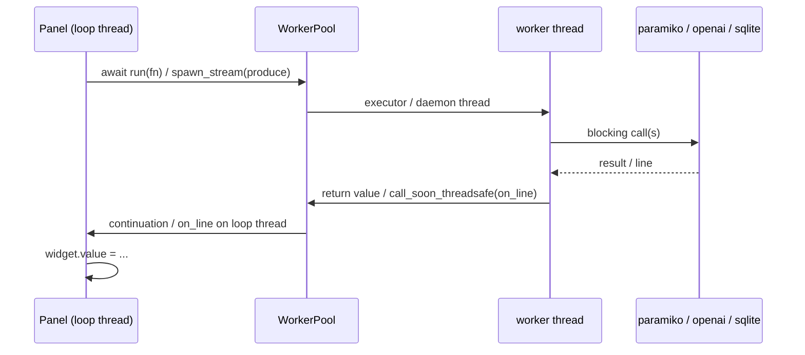

# systemd_mcp.vectordb_ui

A native desktop control panel (Toga / GTK on Linux) over the
[`systemd_mcp.vectordb`](../vectordb/README.md) store. Three tabs:

| Tab          | What it does                                                                                          |
|--------------|-------------------------------------------------------------------------------------------------------|
| **Journald** | Stream `journalctl` from any SSH host (defaults to the QEMU SUT), live `-f` or one-shot, then ingest the visible output into the vector DB. |
| **Search**   | Embed a query through the embedding llama-server and KNN-search the DB, exactly like the `rag_search` MCP tool. Hits expand on click. |
| **Manage**   | Inspect / switch / rename / delete the `.db` file, clear all chunks, or rebuild the LVGL corpus.       |

Run it:

```bash
poetry run llama_debugger_vectordb_ui
# or
python -m systemd_mcp.vectordb_ui
```

Useful flags: `--db PATH`, `--embed-host/--embed-port`,
`--default-host/--default-port/--default-user/--default-password`
(pre-fill the Journald form). See `--help`.

## Why Toga (and not LVGL)

The original plan targeted an LVGL CPython binding so the control UI
would share LVGL with the SUT apps being debugged. That binding
(`lvgl` on PyPI / `kdschlosser/lv_cpython`) is a 2023 release that
fails to build on Python 3.12 (`ModuleNotFoundError: No module named
'builder'`) and is effectively unmaintained. Toga is pure Python with
native backends (GTK here), installs cleanly on 3.12, and lets the UI
import the existing `EmbeddingClient` / `VectorStore` / `paramiko`
stack directly in one process. LVGL is still the *subject* of the
debugging story (the SUT apps, the doc corpus) - just not the toolkit
for this operator panel.

## Module layout

| File                                   | Purpose                                                                                                                |
|----------------------------------------|------------------------------------------------------------------------------------------------------------------------|
| [`cli.py`](cli.py)                     | argparse front-end + `UiConfig` dataclass. Console script `llama_debugger_vectordb_ui`. Imports `app` lazily so `--help` works without the GUI extras. |
| [`app.py`](app.py)                     | `VectorDbUiApp(toga.App)`: window, 3-tab `OptionContainer`, shared DB-path state + a tiny "DB changed" pub/sub, and the `*_blocking` service helpers panels hand to the worker pool. |
| [`workers.py`](workers.py)             | `WorkerPool`: `run()` (await a blocking call off the loop) + `spawn_stream()` (daemon thread for `journalctl -f`, lines marshaled back via `loop.call_soon_threadsafe`). `StreamHandle.stop()` cancels. |
| [`journald_panel.py`](journald_panel.py) | Tab 1. SSH form + log view + paramiko stream generator + "Ingest visible" button.                                    |
| [`rag_panel.py`](rag_panel.py)         | Tab 2. Query box + k + expandable result rows. `open file` for doc hits, hidden for `log://` hits.                    |
| [`manage_panel.py`](manage_panel.py)   | Tab 3. Info dump + Switch / Rename / Delete / Clear / Build, each behind a confirm/file dialog.                       |
| [`ingest_log.py`](ingest_log.py)       | The write path: `chunk_log_text` (journald-entry-aware splitter) + `embed_log_lines` (assemble `ChunkRow`s, `add_batch`). |

## Threading contract (the one hazard)

Toga runs on a single asyncio loop that also owns every GTK widget.
Mutating a widget from another thread is undefined behavior. The rule
this package enforces:

- **Blocking IO never runs on the loop thread.** It goes through
  `WorkerPool.run(fn, ...)` (a `ThreadPoolExecutor`). Because the
  caller is an `async` Toga handler, the code after `await pool.run(...)`
  is already back on the loop thread, so it can touch widgets safely.
- **Streams** (`journalctl -f`) use `WorkerPool.spawn_stream`. The
  producer generator runs in a daemon thread and checks a
  `threading.Event` between lines; each line is delivered to the
  panel's `on_line` via `loop.call_soon_threadsafe`, i.e. on the loop
  thread. This is the same cancel-via-event idiom as `_tail_bg_log` in
  [`systemd_mcp/cli.py`](../cli.py).



## Log provenance (`log://`)

Because this round does **not** add a `kind` column to the schema (that
stays as future work in [`../vectordb/README.md`](../vectordb/README.md#future-work--log-ingestion)),
ingested journal output shares the `chunks` table with the LVGL corpus
and is distinguished by a synthetic path:

```
path    = log://debian@127.0.0.1:2222/sshd     (or .../all)
heading = Jun 03 13:53:01 .. Jun 03 13:59:42
title   = journalctl
```

The Search tab uses this prefix to hide "Open file" for log hits. A
future system-prompt line can tell the chat agent to ignore
`log://`-prefixed hits when it only wants LVGL grounding.

## Dependencies

- `toga`, `toga-gtk` (declared in [`pyproject.toml`](../../pyproject.toml)).
- System GTK + PyGObject (`gir1.2-gtk-3.0`, `python3-gi`) - present on
  most desktop Linux. Toga-gtk pulls `pygobject` as a wheel.

### Wayland note

If the window opens on the wrong display or fails to show under a
Wayland session, force a backend:

```bash
GDK_BACKEND=x11 poetry run llama_debugger_vectordb_ui
```

### Numeric fields are text inputs, not spin buttons

The port / lines / top-k fields are plain `TextInput`s with integer
parsing (`_parse_int`), not `NumberInput`. Toga renders `NumberInput`
as a GTK `GtkSpinButton`, which trips a noisy
`Gtk-CRITICAL ... gtk_box_gadget_distribute: assertion 'size >= 0'
failed in GtkSpinButton` on every layout pass when placed in tight
rows. Using text inputs removes the spin buttons entirely, so that
warning no longer appears, and the steppers add nothing for a debugger
utility anyway.
